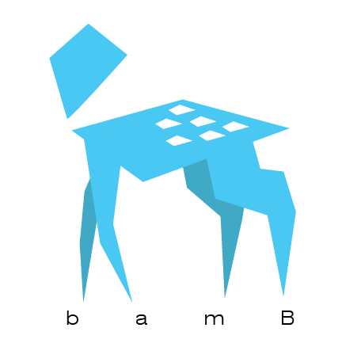
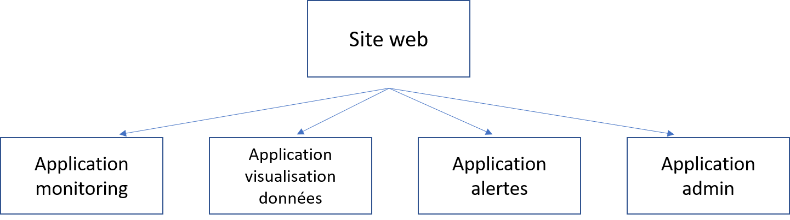

# MONITORING-POLY-CHUM
Ce repo contient le code de l'application web conçue dans le cadre du projet 4 en génie biomédical visant à monitorer les conditions environnementales des salles des départements de radio-oncologie et de médecine nucléaire du CHUM.

Contenu
* [L'équipe](#L'équipe)
* [Overview du projet](#Overview-du-projet)
* [Mise en route de l'application web](#Mise-en-route-de-l'application-web) 
* [Contact](#Contact)
---
## L'équipe
### bamB Weather Watcher  <br>
 <br>

L'équipe **bamB Weather Watcher** est formée de Jessica Asservatham, Rahma Assiani, Sandra Chraim, Sarah El-Tarazi, Émile Jomphe, Madeleine Tjiu-Gildart, Marielle Vaillancourt. Le nom s'inspire des 4 sous-équipes de travail qui se sont formées au cours du projet à savoir :
* Base de données
* Application web
* Microcontrôleur
* Boitier
---
## Overview du projet
Des microcontrôleurs ESP32 muni d'un capteur BME280 font l'acquisition de données de température, humidité et de pression puis les transmettent par wifi à une base de données. Ces données sont ensuite récupérées par l'application web qui permet de faire du monitoring et l'analyse des données. De plus, l'application web permet de générer l'envoie d'alertes par courriel lorsque les paramètres monitorés sortent des seuils établis pour les diverses salles.

L'application web est en fait composée de 4 sous-application à savoir les applications :
* Monitoring
* Visualisaiton de données
* Alertes
* Admin <br><br>


---
## Mise en route de l'application web

1. Clôner le repo dans le dossier courant

     ``` git clone https://github.com/ejomphe/MONITORING-POLY-CHUM.git .``` 

2. Créer et activer un environnement virtuel

    ``` python -m venv venv```

    ``` source venv/Scripts/activate```

3. Installer les dépendences. Note : vérifier d'abord que pip est à jour sinon certaines dépendences ne pourront s'installer.

    ``` python -m pip install --upgrade pip```

    ``` pip install -r requirements.txt```

4. Faire les migrations une fois le nom de la base de données ajusté dans ```settings.py```

    ```python 
    python manage.py makemigrations
     ```
     ```python 
    python manage.py migrate
     ```
5. Créer un super utilisateur

     ```python 
    python manage.py createsuperuser
     ```
6. Lancer l'application web
    
    ```python 
    python manage.py runserver
     ```
     

---
## Contact
Pour toutes informations par rapport à l'application web, vous pouvez contacter :
emile.jomphe@outlook.com
